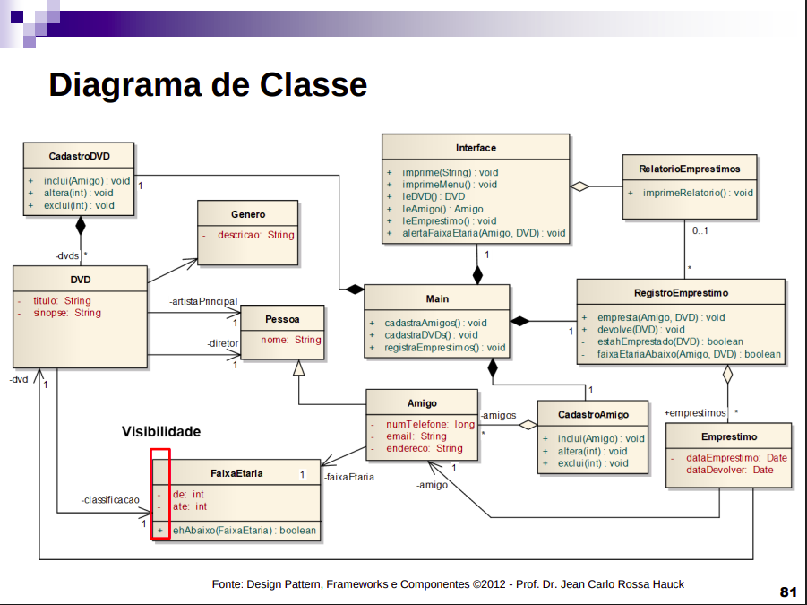

# Sistema de Controle de Empréstimo de DVDs

[](https://opensource.org/licenses/MIT)
[](https://developer.mozilla.org/pt-BR/docs/Web/JavaScript)

Este projeto é um sistema de controle de empréstimo de DVDs desenvolvido em JavaScript como projeto da UC de Modelos, métodos e técnicas da engenharia de software na faculdade UNIFG.

## Descrição

O sistema permite cadastrar amigos, DVDs e registrar os empréstimos, facilitando o controle e evitando a perda de DVDs.

## Problema Proposto

Imagine que seu primo possui muitos DVDs, todos originais, e vive emprestando aos amigos dele. Entretanto, muitas vezes ele esquece a quem emprestou e já perdeu diversos DVDs por causa disso. No almoço da família, no último final de semana, ele pediu para você desenvolver um programa para resolver este problema.

Esse sistema deve permitir o cadastro dos amigos, incluindo: nome, número do telefone e e-mail, e também cadastrar os DVDs, com: título, sinopse, diretor, ator principal, gênero (comédia, romance ou aventura, etc) e faixa etária. Deve ser possível registrar os empréstimos e obter a lista de DVDs emprestados, incluindo quais amigos estão com quais DVDs.

## Funcionalidades

*   Cadastro de Amigos:
    *   Nome
    *   Número de Telefone
    *   E-mail
*   Cadastro de DVDs:
    *   Título
    *   Sinopse
    *   Diretor
    *   Ator Principal
    *   Gênero
    *   Faixa Etária
*   Registro de Empréstimos:
    *   Data de Empréstimo
    *   Data de Devolução
*   Relatórios:
    *   Lista de DVDs Emprestados
    *   Lista de Amigos com DVDs Emprestados

## Modelo de Classes



## Tecnologias Utilizadas

*   [JavaScript](https://developer.mozilla.org/pt-BR/docs/Web/JavaScript)

## Como Usar (Em Construção 🛠️)

1.  Clone o repositório:

    ```bash
    git clone <URL_DO_REPOSITÓRIO>
    ```
2.  Instale as dependências (se houver):

    ```bash
    npm install  # Ou yarn install, dependendo do seu gerenciador de pacotes
    ```
    ```bash
    npm install readline-sync # criar menus simples no terminal para testes
3.  Execute o sistema:

    ```bash
    node index.js  # Ou o comando para iniciar o sistema
    ```

## Contribuição

Contribuições são bem-vindas! Sinta-se à vontade para abrir issues e pull requests.

## Autores

*   Luís Henrique
*   Gizele
*   Isadora
*   Laura